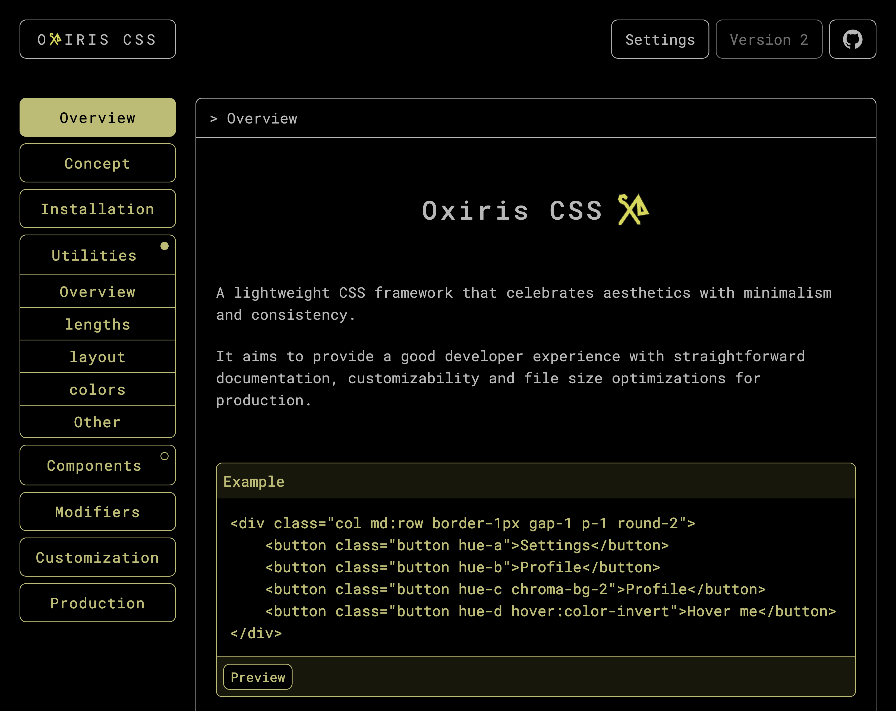
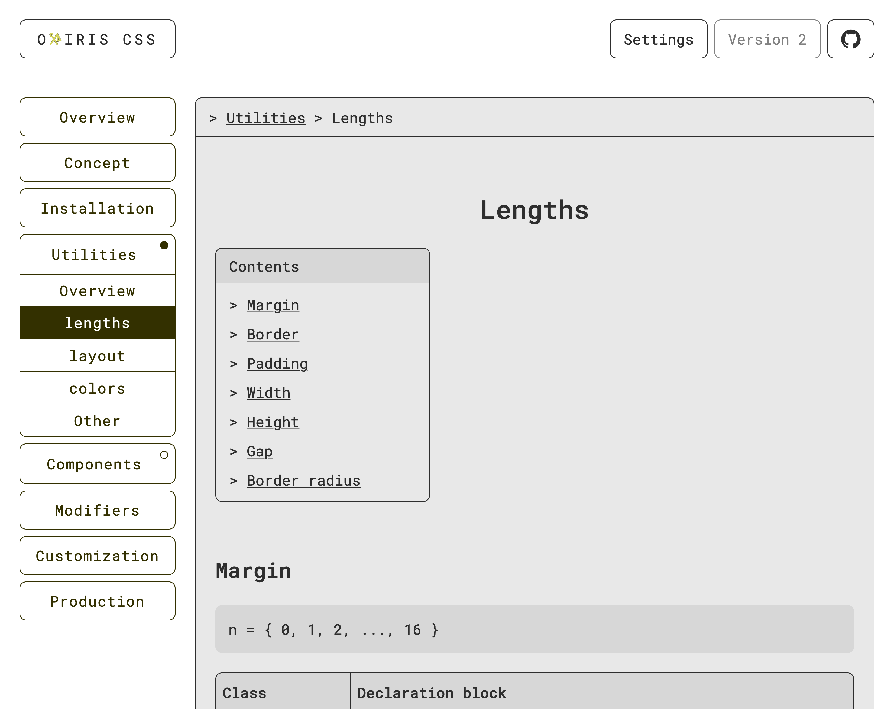
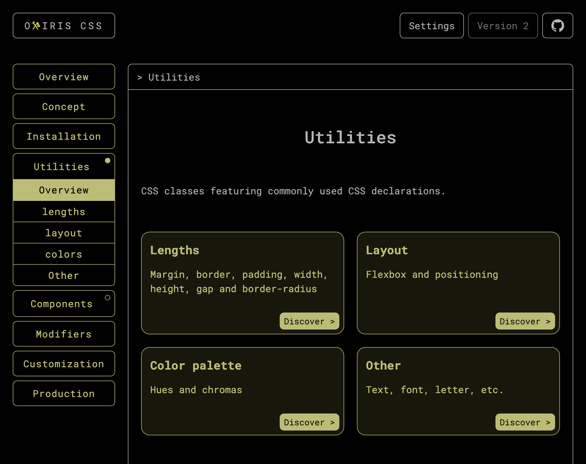

# Oxiris CSS

Full documentation is available at [oxiris.filibit.com](https://oxiris.filibit.com).

Oxiris CSS is a lightweight CSS framework that celebrates aesthetics with minimalism and consistency.

It aims to provide a good developer experience with straightforward documentation, customizability and file size optimizations for production.

## Showcase

